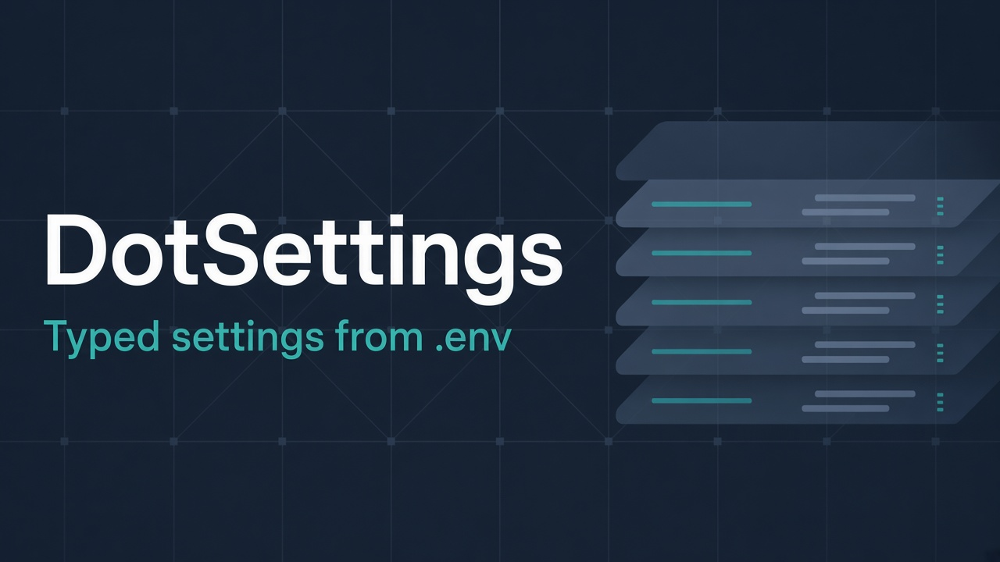

# EnvSettings

Typed application settings bound from `.env` files and process environment variables.

EnvSettings is a small .NET library: you declare settings classes with `[EnvKey]` / `[EnvSubConfiguration]`, call `Env.Load<THost>()`, and get validated instances in a catalog, via `.Shared`, and optionally as DI singletons.

It does **not** ship app-specific schemas, database drivers, Redis clients, or connection-string converters. Your application owns those.

## Install

Core (no DI dependency):

```bash
dotnet add package DotSettings
```

ASP.NET / `Microsoft.Extensions.DependencyInjection` integration:

```bash
dotnet add package DotSettings.DependencyInjection
```

## Quick start

```csharp
using EnvSettings;
using Microsoft.Extensions.DependencyInjection;

public sealed class DatabaseSettings : EnvSettings<DatabaseSettings>
{
    [EnvKey("DATABASE_URL")]
    public string ConnectionString { get; set; } = "";

    [EnvKey("DATABASE_POOL_SIZE")]
    public int? PoolSize { get; set; } // optional
}

public sealed class AppHostSettings
{
    [EnvSubConfiguration]
    public DatabaseSettings Database { get; set; } = new();
}

// Early in Program.cs — before building the host if you need settings for logging, etc.
Env.Load<AppHostSettings>(new Env.LoadOptions
{
    RootPath = AppContext.BaseDirectory, // walks parents looking for .env
    LogToConsole = true,
});

// Same instance everywhere:
var conn = DatabaseSettings.Shared.ConnectionString;
var again = EnvSettingsCatalog.GetSettings<DatabaseSettings>().ConnectionString;

// Requires DotSettings.DependencyInjection
var services = new ServiceCollection();
services.AddEnvSettings(); // registers catalog types as singletons
```

### Rules of thumb

| Rule | Behavior |
|------|----------|
| Property with `[EnvKey("NAME")]` | Bound from `.env` (non-empty) or process env |
| Non-nullable property | Missing key → `EnvConfigurationException` (fail fast) |
| Nullable property (`string?`, `int?`, …) | Missing key → left as default / null |
| Property without attributes | Ignored by the binder |
| `[EnvSubConfiguration]` | Nested settings node (recursion + catalog registration) |

### Refresh

`Env.Refresh()` re-reads the `.env` into a scratch graph. On success it copies values into the live Shared instances; on failure it logs and leaves Shared unchanged.

### Testing

```csharp
Env.ResetForTesting();
Env.LoadPrepared(host); // register instances without reading files
```

## How values are resolved

1. If `RootPath` is set, EnvSettings searches up the directory tree for a `.env` file (optional `.env.tunnel` alongside it).
2. Inside containers (`DOTNET_RUNNING_IN_CONTAINER=true`), only the process environment is used.
3. For each key: non-empty value from the file map wins; otherwise the process environment; otherwise the key is missing.

Inline comments outside quotes are stripped (`VALUE # note` → `VALUE`).

## Logging overrides helper

`LogLevelsParser` parses strings like `Microsoft:Warning;MyApp:Info` into `IReadOnlyDictionary<string, SystemLogLevel>`. Bind a property of that dictionary type with `[EnvKey("LOG_LEVELS")]` and the binder uses the parser automatically.

Bootstrap messages from this library use `EnvBootstrapLog` / `EnvLogLevel` (pluggable sink, default Console) — separate from your app logger.

## Requirements

- .NET 10 (`net10.0`)
- [DotEnv.Core](https://www.nuget.org/packages/DotEnv.Core) (transitive via `DotSettings`)
- [Microsoft.Extensions.DependencyInjection.Abstractions](https://www.nuget.org/packages/Microsoft.Extensions.DependencyInjection.Abstractions) (only with `DotSettings.DependencyInjection`)

## Release process

PRs targeting `development` must include exactly one version label:

| Label | Bump |
|-------|------|
| `patch` | `0.1.0` → `0.1.1` |
| `minor` | `0.1.0` → `0.2.0` |
| `major` | `0.1.0` → `1.0.0` |

On merge, CI bumps `VERSION` (shared by both NuGet packages). Publishing to NuGet is a manual workflow (`publish-nuget`) restricted to maintainers, using [Trusted Publishing](https://learn.microsoft.com/en-us/nuget/nuget-org/trusted-publishing) (OIDC) — no long-lived API key.

Setup once:

1. On [nuget.org Trusted Publishing](https://www.nuget.org/account/trustedpublishing), add a policy for owner `gabrieloliveirabrito`, repo `envsettings`, workflow `publish-nuget.yml`, environment `nuget-publish`.
2. In the GitHub environment `nuget-publish`, set secret `NUGET_USER` to your nuget.org **username** (profile name, not email).

## License

MIT — see [LICENSE](LICENSE).
